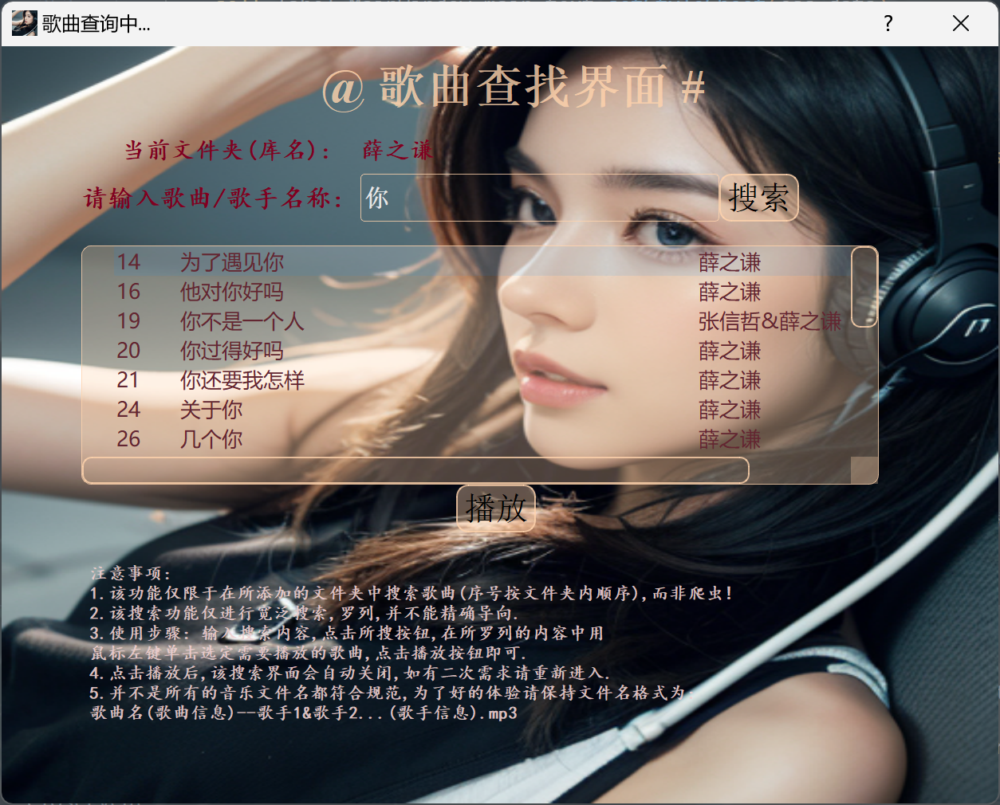

# GUI图片

<!-- 
 -->


# Update log:

## 2023/12 ↓

#### 2.7.11
优化了所有级菜单的创建过程.
原理: 在模块`MyWidgetMethod.py`, 新增内容:
- PackingCreateMethod <class 'type'>
  - my_menu()
  - my_action()
#### 2.6.11
为全部菜单添加了基础样式,为部分菜单项添加了图标.
#### 2.6.10
添加了一个新的全局变量.\
原理: 使用`os.path.dirname(os.path.abspath(__file__)) + r'\phbimage'` 获取图片文件夹路径保存到 *IMAGE_FOLDER_PATH*.
#### 2.6.9
优化了部分代码 \
主要变动: 简化了QMessageBox各类消息框的按键内容;将不必要,不常变动的代码换行取消 
#### 2.6.8
优化了界面布局. \
主要变动: 更改了部分组件的大小,位置,以及文本对齐方式. 
#### 2.6.7
添加了一个自定义模块,增强了可维护性,实现了部分代码的复用.\
原理: 新增模块名 `MyWidgetMethod.py`, 新增内容:
- PackingCreateMethod <class 'type'>
  - my_label()
  - my_button()
- PackingModificationMethod <class 'type'>
  - set_desktop_center() 
  - set_background_image()

#### 2.5.7
优化了代码格式,名称.\
主要变动: 所有类,类方法的注释置于声明下方;将快捷键方案管理函数名称 *change_key_press_programme* 改为 *concentrate_key_press_programme*
#### 2.5.6
优化了代码结构.\
原理: 将访问配置文件的相关操作封装到 *ConfigurationFilesMenu <class 'type'>* (*SettingMenu <class 'type'>* 的内部类)
#### 2.4.6
统一了类名,菜单相关操作类: __Menu\
主要变动: 将 *ChangeKeyPressProgramme* 改为 *ChangeKeyPressProgrammeMenu* .
#### 2.4.5
更改了部分逻辑.\
原理: 将原播放完成检测功能拆分为两个函数 *is_over() <IsOverMonitor 'method'>* (用于检测播放是否完成并返回布尔值) 和 *which_play() <IsOverMonitor 'method'>* (用于在播放完成需进行继续播放时切换播放方式)
## 2023/11 ↓
#### 2.4.4
设置了一个全局变量.\
原理: 使用 `os.path.dirname(os.path.abspath(__file__))` 获取工作目录路径保存到 *WORKING_DIRECTORY_PATH*.
#### 2.4.3
添加了设置菜单,并添加了配置文件的访问.\
原理: 相关操作封装到*SettingMenu <class 'type'>*, 通过系统默认的程序打开文件.\
目前仅两个文件: *.json* *.css*
#### 2.3.3
更改了部分逻辑.\
主要变动: *change_label_current_play_content()<ApplicationWindow 'method'>* 方法将通过 *play_song()<ApplicationWindow 'method'>* 方法调用.保证标签的正确显示.
#### 2.3.2
删除了一些冗余代码.\
主要变动: 移除了对 *Player()<class 'pyglet.media.player.Player'>* 对象的所有 *delete()* 操作.
#### 2.3.1
修复一项重大问题.\
BUG描述: 歌曲正在播放时切换文件夹后连续点击 *开始/暂停按钮* 两次对当前歌曲进行继续播放,当切换后的文件夹文件数*较(切换前)多*时错误的播放切换后文件夹中的内容,当切换后文件夹文件数*较(切换前)少*时导致程序卡顿退出.\
前者通2.3.3.已修复,后者在 *play_song() <ApplicationWindow 'method'>* 方法通过异常处理机制,在底层变量类型错误时抛出错误提示,引导使用者进行正确操作.
#### 2.3.0
优化了 *更改文件夹* 菜单的创建过程\
主要变动: 修改了 *PlayerConfig.json* 中设置文件夹名称与路径项(*music_folders_path*) 的储存方式,即使用三层嵌套列表来控制菜单结构.并且,菜单创建时使用嵌套循环来减少重复的代码.
#### 2.2.0
添加了基本的样式设置.\
原理: 使用 *PlayerStyle.css* 文件进行样式的配置.目前样式的更改仅通过修改CSS文件.
#### 2.1.0
将部分组件的名称规范化,最终名称如下: 
|用途|名称|
:--|:--
一级UI主体标签|*label_MainWindow_main_text*
"正在播放"标签|*label_current_play_text*
显示当先正在播放歌曲名称的标签|*label_current_play_content*
上一首按钮|*button_previous*
下一首按钮|*button_next*
开始/暂停按钮|*button_pause_or_begin*
随机播放按钮|*button_shuffle_play*
单曲循环按钮|*button_single_loop*
退出按钮|*button_quit*
提示标签|*label_warning_text*
菜单栏|*menubar*
SearchUI主体标签设置|*label_SearchUI_main_text*
"当前文件夹(库名):"标签|*label_folder_path_text*
显示当前文件夹路径的标签|*label_current_folder*
输入提示文本标签|*label_input_reminder_text*
输入框|*lineEdit_input_song_title*
搜索按钮|*button_searching*
用于显示搜索结果的树形图|*treeview_search_result*
播放所选歌曲按钮|*button_play_selected_song*
注意事项文本标签|*label_use_attention_text*

#### 2.0.0
对UI界面进行了重构\
主要变动: 使用PyQt5模块在保持原功能不变的基础上重新构建了所有UI界面.类名 *APP* 改为 *ApplicationWindow*
#### 1.14.10
将本地音乐文件夹路径配置设置在 *PlayerConfig.json* 文件\
主要变动: 
|新增key|
|---|
|  *"music_folders_path"*  |
## 2023/10 ↓
#### 1.14.9
添加了本地数据保存功能.\
原理: 使用 *PlayerConfig.json* 文件进行部分底层数据的初始化,以及一些关键数据的储存.

| 新增key|
|----|
|  *"music_folder_path"*  |
|  *"current_music_number"*  |
|  *"file_total_time"*  |
|  *"current_position"*  |
|  *"need_cycle"*  |
|  *"key_press_programme"*  |
|  *"current_music_name"*  |
|  *"play_dict"*  |

#### 1.13.9
优化了代码格式\
主要变动: 将全部抽象的代码简单化,格式化.
## 2023/9 ↓
#### 1.13.8
更改了一类冗余写法.\
主要变动: 将r"xx\xx\xx".replace('\\', '\\\\')的写法简化成r"xx\xx\xx" 
#### 1.13.7
解决了一个编码隐患.\
主要变动: 弃用非UTF-8编码的'♥️',启用UTF-8编码的'❤️'.
#### 1.13.6
添加了主UI菜单"快捷方式".\
原理: 将键盘快捷方案的切换关联到该菜单.详见 *ChangeKeyPressProgramme <class 'type'>* ;
#### 1.12.6
添加了快捷键方案管理函数.\
原理: 详见 *change_key_press_programme() <KeyboardListener 'method'>* 
#### 1.12.5
添加了新的键盘快捷键方案.\
原理: 键盘快捷键方案( *key_press_p3() <KeyboardListener 'method'>* :数字键盘, *key_press_p4() <KeyboardListener 'method'>* :Ctrl+数字键盘(方案4当前使用的第三方库无法区分主键盘与数字键盘的数字键))
#### 1.11.5
添加了新功能:键盘快捷键.\
原理: 在App启动时将开启一个新的子线程(所有相关操作封装到 *KeyboardListener <class 'type'>*) 来监听键盘事件;可以在播放器UI界面最小化时更便捷的进行一些基本操作(下一首,上一首,暂停/开始,随机播放,单曲循环).\
提供了2套键盘快捷键方案( *key_press_p1() <KeyboardListener 'method'>* :主键盘+方向键, *key_press_p2() <KeyboardListener 'method'>* :Ctrl+主键盘)
#### 1.10.5
优化了代码结构\
主要变动: 将 播放完毕检测功能 的所有实例与方法从 *APP <class 'type'>* 中剥离,并整合到一个新的局部类 *IsOverMonitor <class 'type'>* 中.
## 2023/7 ↓
#### 1.9.5
优化了代码结构\
主要变动: 将一级菜单 *更改文件夹* 的所有属性与方法从 *APP <class 'type'>* 中剥离,并整合到一个新的局部类 *ChangeFolderMenu <class 'type'>* 中.
#### 1.8.5
优化了代码结构\
主要变动: 将所有变量的保护属性移除;将 *歌曲搜索界面* 的所有属性与方法从 *APP <class 'type'>* 中剥离,并整合到一个新的局部类 *SearchUI <class 'type'>* 中,增强代码可读性,便于代码查找,修改与增添.
#### 1.7.5
添加了单曲循环功能按钮.\
原理: 通过按钮来改变 循环标志 *self._need_cycle* ,依此来切换 播放完成检测 *is_over() <APP 'method'>* 中的播放方法 *play_song() <APP 'method'>* | *random_play() <APP 'method'>* 
#### 1.6.5
添加了播放完成检测操作,来保证良好的听歌体验.\
原理: 在App启动时将开启一个新的子线程 递归函数 *is_over() <APP 'method'>* 来监测文件的播放进度,当文件播放至结尾时将进行一系列操作(如随机播放下一首),该函数将持续到App关闭.当前,递归函数的递归间隔为3000ms,自动切歌时比较比较流畅.
#### 1.5.5
为上一首(按钮操作)与下一首(按钮操作)添加了错误提示.
#### 1.5.4
添加了查找歌曲进行定向播放的功能,即菜单"查找歌曲"中的二级UI界面.\
原理: 主要体现为下述实例与方法的组合应用 文本输入框 *entry*由*tkinter.Entry* 创建, 搜索按钮 *searching()* , 树型图表的显示 *self._treeview_search_result* ,树型图表内鼠标事件 *onclick() <APP 'method'>* , 播放按钮绑定 *second_ui_play() <APP 'method'>* , 关闭协议 *second_ui_root_protocol() <APP 'method'>* .
#### 1.4.4
添加了主UI界面中对当前播放的音乐文件名称显示的功能.\
原理: 标签 *_current_play_label* 跟随 *self._current_music_number* 的动态变化.
#### 1.3.4
添加了主UI菜单 *更改文件夹* ,来选择自己喜欢的播放列表.\
原理: 多级菜单,下拉菜单项与目标文件夹路径的绑定.
## 2023/6 ↓
#### 1.2.4
将UI窗口搭建 *build_platform() <APP 'method'>* 与窗口居中且固定大小 *center() <APP 'method'>* 的调用绑定到 *APP <class 'type'>* 对象的构造函数中. 
#### 1.2.3
更改了 *update_song_list() <APP 'method'>* 的部分代码描述.
#### 1.2.2
为每个具有播放功能的控件添加了 #确保解密/确保对象类型为int 的操作.
#### 1.1.2
修复了播放状态下,点击"暂停"控件后再点击"上一首"控件或"下一首"控件时出现的异常.
#### 1.1.1
修改了"暂停|开始"控件的作用域,为 *APP <class 'type'>* 全局.
#### 1.1.0
添加了"暂停|开始"控件与"随机播放"控件在点击时对应的"暂停|开始"控件的文本变化.
#### 1.0.0.
1.0.0.has been finished 
#### start
project start at 2023/6/14


""" """ """ """ """ """ """ """ """ """ """ """ """ """ """ """ """ """ """ """ """ """ """ """ """ """ """ """ """ """ """ """ """ """ """
#### 1.0版本源码 QwQ:该版本现已无法正常运行,仅将其置于此作为纪念
```
# code block
"""
Maker: HDJ
Start at: 2023/6/14
Last modified date: 2023/6/18
"""
import tkinter
import tkinter.messagebox
import glob
import os
import random
import pyglet


class App(object):

    def __init__(self, width=500, height=400):
        self._ui_width = width
        self._ui_height = height
        self._ui_title = '音乐播放器'
        self._ui_root = tkinter.Tk(className=self._ui_title)#创建一个名称为self._ui_titled的窗口
        self._play_dict = {}
        self._current_music_number = None
        self._player = None#播放器
        self._current_position = None#当前(文件的)播放位置
        #此处修改音乐文件夹的绝对路径
        self.music_file_path = '\\py.1求道境\\1.tkinter模块\\音乐随机播放器\\music'

    @property
    def root(self):
        return self._ui_root

    @property
    def play_dict(self):
        return self._play_dict

    def set_play_dict(self, key, value):
        self._play_dict[key] = value

    @property
    def current_music_number(self):
        return self._current_music_number

    @current_music_number.setter
    def current_music_number(self, number):
        self._current_music_number = number

    #更新音乐列表
    def update_song_list(self):
        # 音乐文件夹
        music_file_path = self.music_file_path
        # 获取mp3路径列表
        mp3_files_list = glob.glob(os.path.join(music_file_path, '*.mp3'))
        # 创建播放字典
        for music_number, music_path in enumerate(mp3_files_list, start=1):
            self._play_dict[f'{music_number}'] = f'{music_path}'

    #播放音乐
    def play_song(self, music_position=0):
        #加载音乐文件
        music_file_path = self._play_dict.get(f'{self._current_music_number}')
        #根据文件创建music对象
        music = pyglet.media.load(music_file_path)
        #创建播放器
        self._player = pyglet.media.Player()
        #将music对象添加到播放器(player)
        self._player.queue(music)
        #调整播放位置
        self._player.seek(music_position)
        #开始播放
        self._player.play()

    # 随机播放(按钮操作)
    def random_play(self):
        if self._current_music_number is not None:
            self._player.pause()
            self._player.delete()
        self._current_music_number = random.randint(0, 8)
        self.play_song()

    # 上一首(按钮操作)
    def previous_play(self):
        self._player.pause()
        self._player.delete()
        self._current_music_number -= 1
        if self._current_music_number == 0:
            self._current_music_number = len(self._play_dict)
        self.play_song()

    # 下一首(按钮操作)
    def next_play(self):
        self._player.pause()
        self._player.delete()
        self._current_music_number += 1
        if self._current_music_number > len(self._play_dict):
            self._current_music_number = 1
        self.play_song()

    #暂停||开始(按钮操作)
    def music_pause(self):
        # 开始路径1:如果之前无播放内容,则随机播放  QwQ:克服选择困难症
        if self._current_music_number is None:
            self.random_play()
            #按钮文本显示为"暂停"

        # 开始路径2:之前有播放内容被暂停,点击按钮继续播放
        elif type(self._current_music_number) == str:# QwQ:通过类型的转化来区分路径
            self._current_music_number = int(self.current_music_number.replace('*', ''))
            self.play_song(self._current_position)
            self._current_position = None

        # 当前有文件正在播放,点击按钮暂停
        else:
            self._current_position = self._player.time
            self._player.pause()
            self._current_music_number = f'*{self._current_music_number}'# QwQ将当前播放序号在转类型的时候稍微加密
            # 按钮文本显示为"开始"

    # 确认退出(按钮操作)
    def confirm_to_quit(self):
        if tkinter.messagebox.askokcancel('温馨提示', '确定要退出吗?'):
            self._ui_root.quit()

    # UI搭建
    def build_platform(self):
        # 创建一个主体文字标签
        text_label = tkinter.Label(self._ui_root, text='Q*& 私人专属音乐播放工具 Qwq', font=("楷体", 16), fg='red')
        text_label.pack(expand=1)

        # 控件设置
        # 框架
        frame1 = tkinter.Frame(self._ui_root)
        frame1.pack()
        frame2 = tkinter.Frame(self._ui_root)
        frame2.pack()
        frame3 = tkinter.Frame(self._ui_root)
        frame3.pack()

        # f1
        button_previous = tkinter.Button(frame1, text='上一首', command=self.previous_play)
        button_previous.pack(side='left')
        button_next = tkinter.Button(frame1, text='下一首', command=self.next_play)
        button_next.pack(side='right')
        button_pause = tkinter.Button(frame1, text='暂停', command=self.music_pause)
        button_pause.pack(side='top')
        # f2
        button_shuffle = tkinter.Button(frame2, text='随机播放', command=self.random_play)
        button_shuffle.pack()
        button_quit = tkinter.Button(frame2, text='退出', command=self.confirm_to_quit)
        button_quit.pack()
        # f3
        label_explain = tkinter.Label(frame3, text='此工具仅用于学术交流!', font=("楷体", 10), fg='blue')
        label_explain.pack()

    #窗口位置居中,大小固定
    def center(self):
        self._ui_root.resizable(False, False)#禁止修改窗口大小
        ws = self._ui_root.winfo_screenwidth()
        hs = self._ui_root.winfo_screenheight()
        x = int((ws / 2) - (self._ui_width / 2))
        y = int((hs / 2) - (self._ui_height / 2))
        self._ui_root.geometry('{}x{}+{}+{}'.format(self._ui_width, self._ui_height, x, y))


def main():
    app = App()
    app.update_song_list()
    app.build_platform()
    app.center()
    app.root.mainloop()


#查看播放列表
def get_dict():
    app = App()
    app.update_song_list()
    print(app.play_dict)


if __name__ == '__main__':
    main()
    #get_dict()
```
""" """ """ """ """ """ """ """ """ """ """ """ """ """ """ """ """ """ """ """ """ """ """ """ """ """ """ """ """ """ """ """ """ """ """

