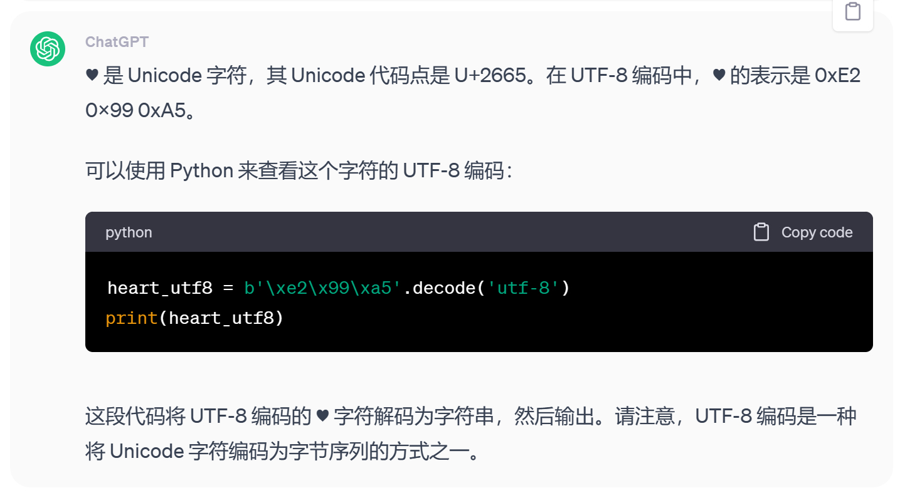
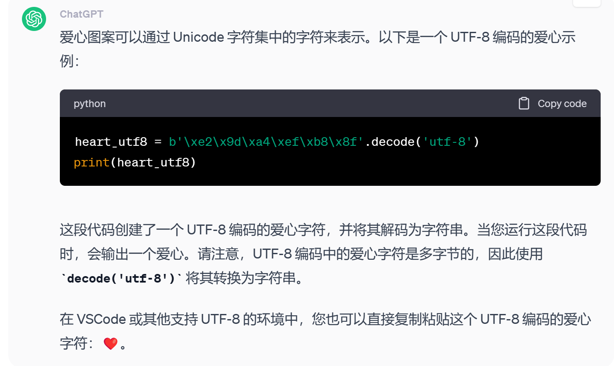

## 被非UTF-8制裁了
事件的起因是我在初学json文件在Python中的操作时发现把直接的字符串替换成等价的js操作(通过键获取值),导致一个依赖这个字符串的random()报错范围为空,无法生成随机数,然后就踏上了漫长的Debug之旅Qwq

请看下面这段代码:
```
# code block 1
import json

dict ={
    "MusicFolderPath": "C:\\Users\\HDJ\\Music\\歌曲\\♥",
}

#with open(r'py.1求道境\音乐随机播放器\PlayerConfig.json', 'r', encoding='utf-8') as configjson:
    #jsdate = json.load(configjson)

print(dict['MusicFolderPath'])
print(type(dict['MusicFolderPath']))
print(r"C:\Users\HDJ\Music\歌曲\♥️")
print(type(r"C:\Users\HDJ\Music\歌曲\♥️"))
print(r"C:\Users\HDJ\Music\歌曲\♥️" == dict['MusicFolderPath'])


#C:\Users\HDJ\Music\歌曲\♥
#<class 'str'>
#C:\Users\HDJ\Music\歌曲\♥️
#<class 'str'>
#False
```

#### 这次只保留纯英文字符
```
# code block 2
import json

dict ={
    "MusicFolderPath": "C:\\Users\\HDJ\\Music",
}

#with open(r'py.1求道境\音乐随机播放器\PlayerConfig.json', 'r', encoding='utf-8') as configjson:
    #jsdate = json.load(configjson)

print(dict['MusicFolderPath'])
print(type(dict['MusicFolderPath']))
print(r"C:\Users\HDJ\Music")
print(type(r"C:\Users\HDJ\Music"))
print(r"C:\Users\HDJ\Music" == dict['MusicFolderPath'])


#C:\Users\HDJ\Music
#<class 'str'>
#C:\Users\HDJ\Music
#<class 'str'>
#True
```

#### 这次加上中文
```
# code block 3
import json

dict ={
    "MusicFolderPath": "C:\\Users\\HDJ\\Music\\歌曲",
}

#with open(r'py.1求道境\音乐随机播放器\PlayerConfig.json', 'r', encoding='utf-8') as configjson:
    #jsdate = json.load(configjson)

print(dict['MusicFolderPath'])
print(type(dict['MusicFolderPath']))
print(r"C:\Users\HDJ\Music\歌曲")
print(type(r"C:\Users\HDJ\Music\歌曲"))
print(r"C:\Users\HDJ\Music\歌曲" == dict['MusicFolderPath'])


#C:\Users\HDJ\Music\歌曲
#<class 'str'>
#C:\Users\HDJ\Music\歌曲
#<class 'str'>
#True
```

现在这个心型图案有大嫌疑!我们来问一下ChatGPT



通过分析,暂定解决方法为找一个UTF-8编码的图案代替'♥'



最后我们得到了'❤️',再来试一试运行

```
# code block 4   
import json

dict ={
    "MusicFolderPath": "C:\\Users\\HDJ\\Music\\歌曲\\❤️",
}

#with open(r'py.1求道境\音乐随机播放器\PlayerConfig.json', 'r', encoding='utf-8') as configjson:
    #jsdate = json.load(configjson)

print(dict['MusicFolderPath'])
print(type(dict['MusicFolderPath']))
print(r"C:\Users\HDJ\Music\歌曲\❤️")
print(type(r"C:\Users\HDJ\Music\歌曲\❤️"))
print(r"C:\Users\HDJ\Music\歌曲\❤️" == dict['MusicFolderPath'])


#C:\Users\HDJ\Music\歌曲\❤️
#<class 'str'>
#C:\Users\HDJ\Music\歌曲\❤️
#<class 'str'>
#True
```
问题解决了QWQ,这个问题恶心就恶心在你用非UTF-8的字符时,光print是看不出来的(因为输出结果肉眼看着完全一样),但是进行一些特殊操作非UTF-8就暴雷了...比如说'=='

在问题代码可能有以下原因(均依赖于含非UTF-8字符的字符串)
#### 用 UTf-8 读取
```
with open(r'py.1求道境\音乐随机播放器\PlayerConfig.json', 'r', encoding='utf-8') as configjson:
    jsdate = json.load(configjson)
``` 
#### glob()或join()方法
```
mp3_files_list = glob.glob(os.path.join(music_file_path, '*.mp3'))
```